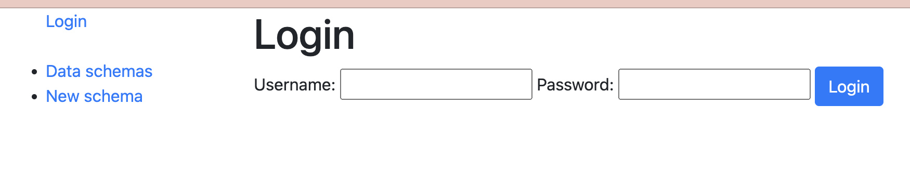
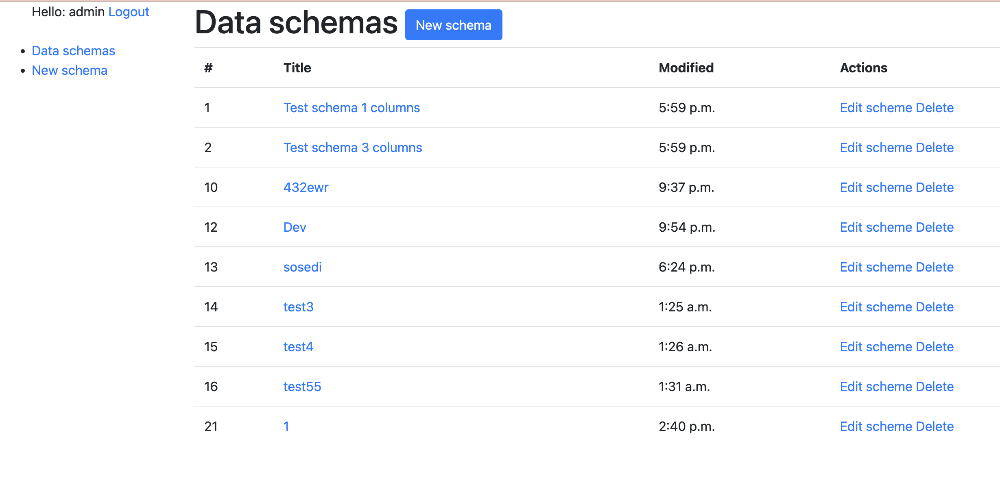
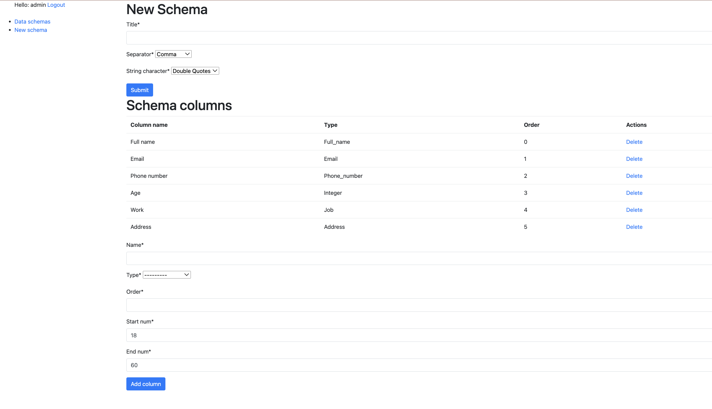
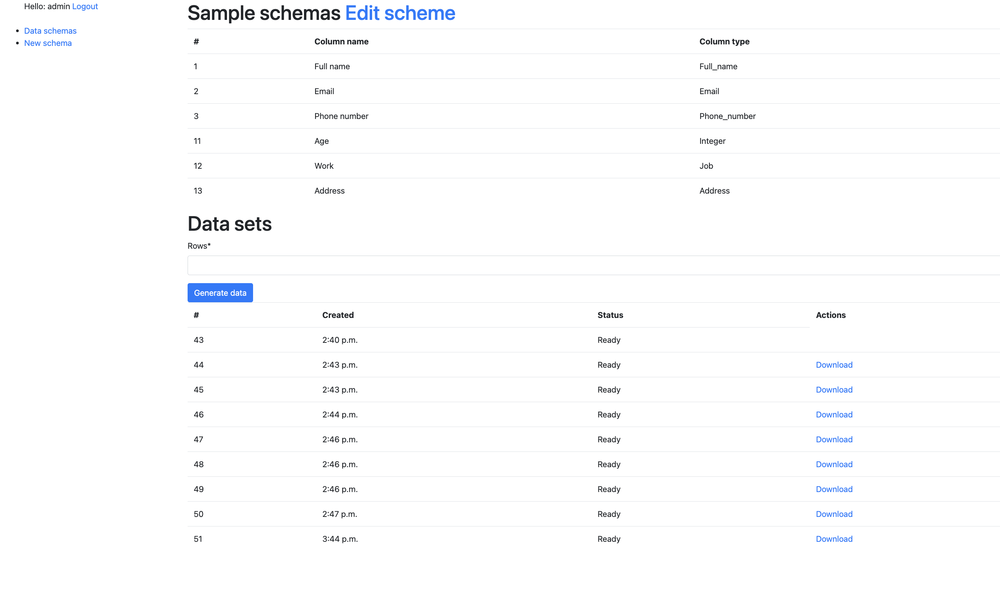

# Fake csv

Django online service for generating CSV files with fake data

## Check it out!

[Project deployed to PythonAnywhere](https://www.pythonanywhere.com/)

**Test user**

Login: _admin_

Password: _admin12345_

## Installation

Python3 must be already installed

```shell
git clone https://github.com/hikehikehike/fake_csv
python3 -m venv venv
sourse venv/bin/activate
pip install -r requirements.txt
python manage.py runserver
```

### Features

* only authorized users can use the service
* Users can build the data schema with any number of columns of any type
* After creating the schema, the user can input the number of records he/she needs to generate
* Users can download CSV file


## Demo

#### Login:



#### Schema list:



#### Create schema:



#### Generate data sets:



